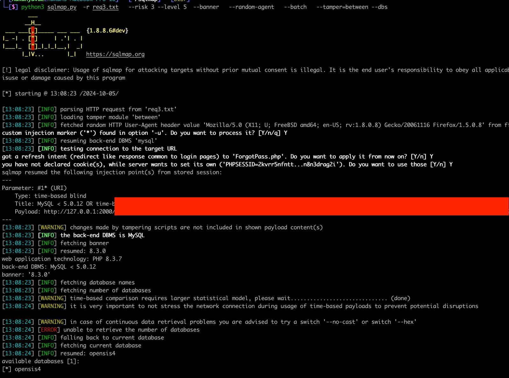
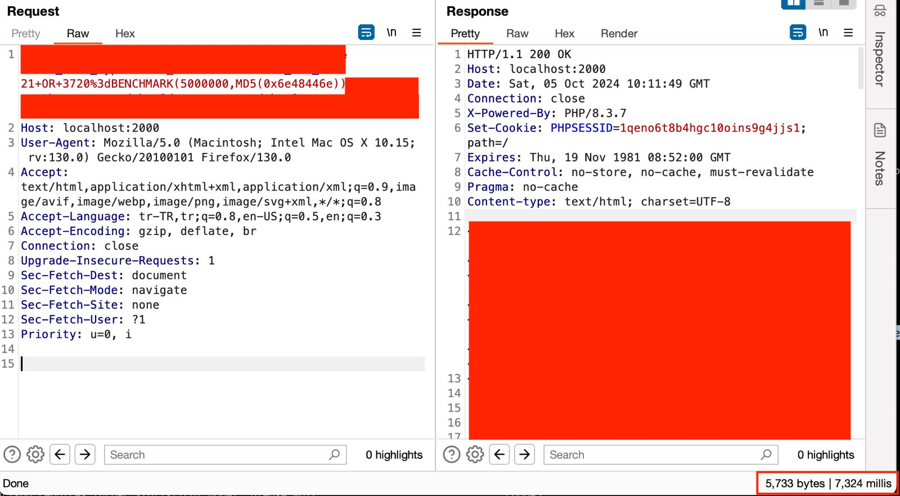

# UnAuthenticated SQL Injection Vulnerability in openSIS-Classic Version 9.1 Web Application

## Description:

An unauthenticated SQL injection vulnerability has been discovered in openSIS-Classic Version 9.1. This flaw allows remote attackers to execute arbitrary SQL commands against the database without needing to authenticate to the application.

## Affected Version

openSIS-Classic: 9.1 and 9.0

## Vulnerability Details:

Type: SQL Injection
Impact: The vulnerability exists due to improper sanitization of user-supplied input in certain parameters of the web application. An attacker can exploit this issue by injecting malicious SQL code into these parameters, leading to unauthorized access to sensitive data or manipulation of the database.

## Proof of Concept (PoC)

I'll explain the PoC code when I hear back from the manufacturer.

## Credits

    Discovered by Kutsal Gürlek in 05/10/2024

## Disclaimer

This information is provided for educational and informational purposes only. The author is not responsible for any misuse of this material.
